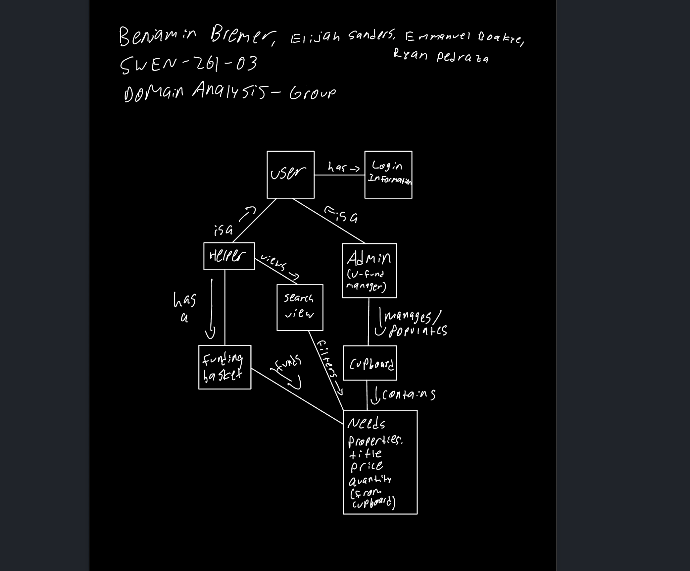
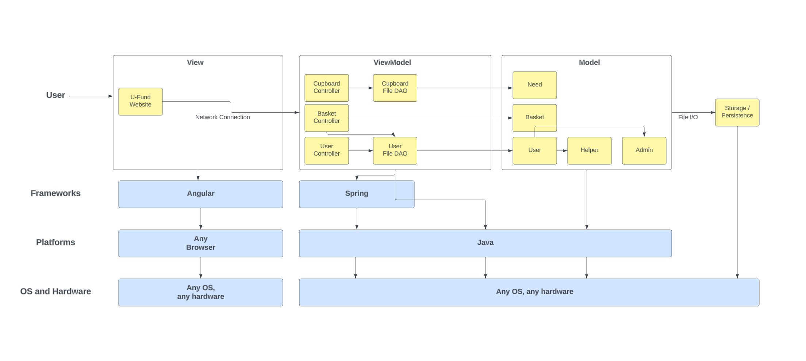
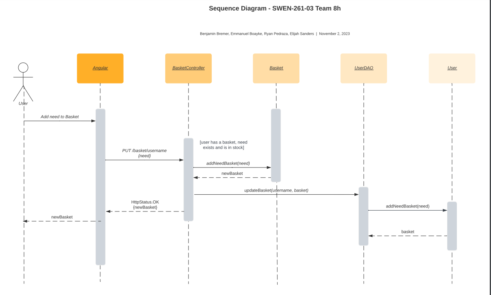
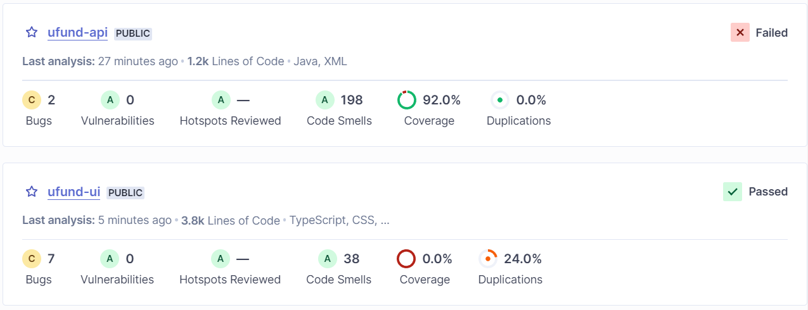
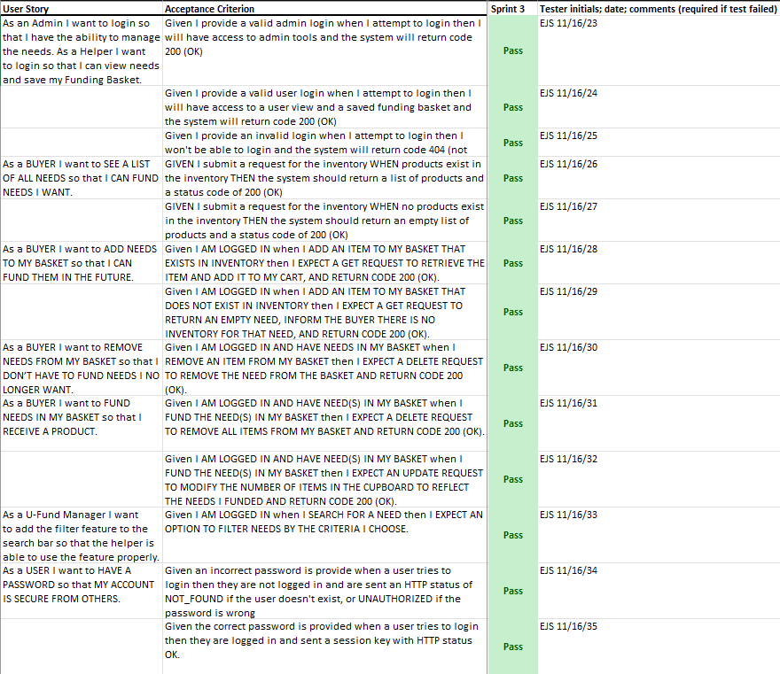
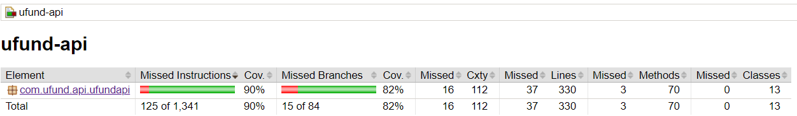
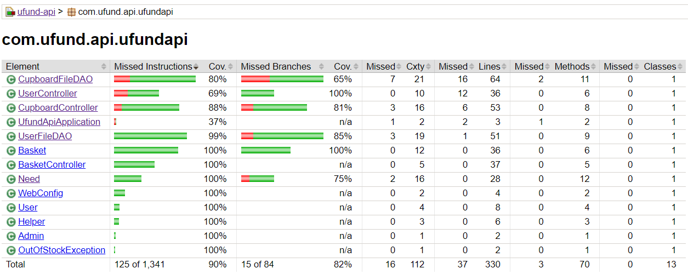
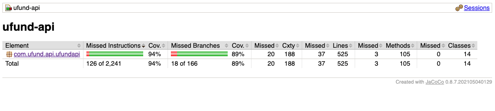
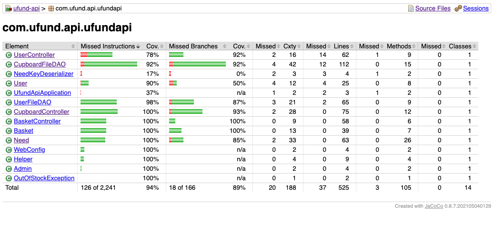

# Rubber Duck Adoption Design Documentation

## Team Information
* Team name: 261-03 Team 8h
* Team members
  * Benjamin Bremer
  * Elijah Sanders
  * Ryan Pedraza
  * Emmanuel Boakye

## Executive Summary

Our ufund project allows users to support a variety of charities and causes 
through the process of "adopting" the rubber duck that represents the charity.
Through our UI, they can search for charities and causes that need funding 
based on several different parameters, add various charities and causes to 
their basket to save for later, and fund one or multiple charities and causes
as they desire. 

### Purpose
The purpose of this project is to provide users with a clean and concise 
interface to support a charity. It provides users with the ability to view
and fund the charity's needs. Administrators are able to manage the needs
presented to users.

### Glossary and Acronyms

| Term          | Definition                                                               |
|---------------|--------------------------------------------------------------------------|
| SPA           | Single Page Application                                                  |
| User          | Admin OR Helper                                                          |
| Helper        | User funding Needs                                                       |
| Admin         | User managing Needs                                                      |
| Need          | A charity or cause that needs funding                                    |
| Basket        | The collection of Needs that the Helper may desire to fund               |
| Funding Needs | Refers to the process of "checking out", or financially supporting needs |
| Cupboard      | The collection of Needs that need funding.                               |

## Requirements

This section describes the features of the application.

### Definition of MVP
* Minimal Authentication for Helper/U-fund Manager login & logout
  * The server will (admittedly insecurely) trust the browser of who the user is. A simple username to login is all that is minimally required. Assume a user logging in as admin is the U-fund Manager.
  * You are not expected to do full credential and session management, although the system will look different depending on who is logged in. Obviously this isn't how things are done in real life, but let's sidestep that complexity for this class.
* Helper functionality
  * Helper can see list of needs
  * Helper can search for a need
  * Helper can add/remove an need to their funding basket
  * Helper can proceed to check-out and fund all needs they are supporting
* Needs Management
  * U-fund Manager(s) can add, remove and edit the data of all their needs stored in their needs cupboard
  * A U-fund Manager cannot see contents of funding basket(s)
* Data Persistence
  * Your system must save everything to files such that the next user will see a change in the needs cupboard based on the previous user's actions. So if a Helper had something in their funding basket and logged out, they should see the same needs in their cupboard when they log back in.
  * Ordinarily, we would want to use a database for this - but this semester our system will not reach a complexity that requires a database. You learned basic file I/O in your programming courses, so utilize what you know from there.

### MVP Features
* Manage Needs in Cupboard (U-Fund Manager(s))
  * The U-Fund Manager(s) should be able to create a new Need for the Cupboard
  * The U-Fund Manager(s) should be able to update a Need in the Cupboard
  * The U-Fund Manager(s) should be able to get / view Needs in the Cupboard
  * The U-Fund Manager(s) should be able to login
* Fund Needs in the Cupboard (Helper(s))
  * The Helper(s) should be able to get / view all Needs in the Cupboard
  * The Helper(s) should be able to search for Needs by their name
  * The Helper(s) should have a basket that they can add Needs to
  * The Helper(s) should be able to fund their basket

### Enhancements
* Search Filter
  * The Helper(s) should be able to search for Needs by the tags assigned to them
  * The U-Fund Manager(s) should be able to assign tags to Needs when creating or updating them in the Cupboard
* Login Authentication
  * The Helper(s) and U-Fund Manager(s) should have both a username and a password with a unique (salted) hash that allows for secure authentication to their account. 

## Application Domain

This section describes the application domain.

The domain of this project flows as follows: there are Users. Users have 
the ability to login to their account. A User is either an Admin or a Helper. 
An Admin user modifies / manages the Cupboard, which contains Needs. A Helper 
has a basket, which contains Needs. A Helper can also view / search the Needs 
in the Cupboard. The Cupboard contains Needs. A Need contains all the 
properties related to it: how many of the Need need to be funded (the stock), 
the price of the Need, the name of the Need, and the category of the Need 
(which is used by the search functionality). 

## Architecture and Design

This section describes the application architecture.

### Summary

The following Tiers/Layers model shows a high-level view of the webapp's architecture. 

The web application, is built using the Model–View–ViewModel (MVVM) architecture pattern. 

The Model stores the application data objects including any functionality to provide persistance. 

The View is the client-side SPA built with Angular utilizing HTML, CSS and TypeScript. The ViewModel provides RESTful APIs to the client (View) as well as any logic required to manipulate the data objects from the Model.

Both the ViewModel and Model are built using Java and Spring Framework. Details of the components within these tiers are supplied below.

### Overview of User Interface

This section describes the web interface flow; this is how the user views and interacts with the web application.

The user is presented with a login page, where they have to enter the correct username and password in order to gain access to their account. The user then sees the list of all the available needs and is able to search for a specitic need by name or by its descriptive tags in the search bar. Once a user has found a need they would like to support, they can add as many as they please to their cart (not going over the current stock). To view their cart, the user can simply click the cart button at the top of the page and be redirected to see their cart and total. Once here, the user can checkout and either go back to the needs to support more or logout if they are finished.

### View Tier
When the user enters the application, the login screen is presented with 2 text fields to enter their username and password and a login button that processes this request. If unsuccessful, a message with an error will pop up and the user may try again. If successful, the user will be entred into the main page with the list of needs, a search bar, and 3 buttons to navigate to the cart and back to the needs list and one to logout. The neeeds are presented in a table with their ID, stock, price, name, and description. Upon clicking on the name of a need, the user can view the full details on the need's details page they get redirected to upon clicking. A go back button is provided when the user is done viewing and wnats to view all the needs. This same sequence happens when a user searches for a need by name or tag and clicks on the need's name. In the details is where the user can add the need to their cart and once they are done they can view their cart by clicking the cart button. On the cart page the user can view the total and remove needs if they please. When the user wants to checkout, they can simply click the checkout button and the process is finished.

>

### ViewModel Tier
The ViewModel tier uses http requests to process all backend connection for persistence and html, css, and angular type scripts to show the results in the UI. A login service for both users and admins and redirects to the correct page based on who is logging in. For an admin, the http requests for all the need handling pass requests to the CupboardFileDAO and for the user requests are passed to the UserFileDAO. With every button click tarcking the actions of the user and admin, the website is updated accrodingly with any new updates, additions, or deletions.

### Model Tier
The Model tier consists of three primary models that use two DAO's:  
* The Need model stores all the data related to need. It used the CupboardFileDAO for persistence. 
* The Basket model stores a User's basket. It uses the UserFileDAO for persistence, since the Basket object is stored alongside the User that has it. 
* The User model is split into two parts: Admin and Helper. They both store whether or not the User is an Admin, a username, and, if the User is a Helper, a Basket. The User model uses UserFileDAO for persistence. 

## OO Design Principles

### Open/Closed Principle
This principle states that: “Software entities should be open for extension, but closed for modification.” Our CupboardFileDAO Class was implemented from our CupboardDAO interface. This allowed us to define a CupboardDAO that could be implemented differently but be used by other classes in the same way. An interface was also used for the UserDAO class for the same reasons. 

An abstract User class was inherited by Admin and Helper classes. This allows all users to have shared functionality while separating the functions that are unique to each. All users have a username and a boolean that determines if they are an admin, but only Helpers have a basket. All users share the funcitons getUsername(), updateUsername(), and isAdmin(). Only helpers have the functions getBasket() and updateBasket(). In the future, more distinction could be made between Helpers and Admins without needing to change the base User class.

### Single Responsibility
This principle states that: “A class should have only a single responsibility”. Each of our classes has its own responsibility. The CupboardController handles the HTTP requests for Needs. The CupboardFileDAO connects the requests with the stored data. The Need class stores information about a need. The CupboardController doesn’t deal with how the data is stored and managed, the CubpoardFileDAO does that. The Need Class allows the information contained in a need to be changed without needing to change any of the other pieces of the project. 

A similar structure is used for Users and Baskets. There is a UserController that handles HTTP requests related to Users and a BasketController that handles HTTP requests for the users's Basket. The UserFileDAO handles accessing and updating the users stored in JSON files. The User class and it's subclasses Admin and Helper define the function of the users. Each of these implementations could be modified without impacting the other classes.

### Pure Fabrication
This principle states to: “Assign a cohesive set of responsibilities to a non-domain entity in order to
support Single Responsibility and Low Coupling.” In our UI, we have a login service that adheres to thos principle. In the login service, it handles requests to both open the user side of the UI and the admin side of the UI in one class, instead of making it two seperate classes. By doing this, it allows for our application to be ran easier and allows for proper back-and-forth communication between the two sides of the UI. 

Without the shared login service, each component would have an independent one that would have to communicate with a whole new component that would take the requests of each side's login and have to handle whether they are a user or an admin. Following this principle takes away this hassle and unnecessary extra code.

### Controller
This principle states that there should be a controller to: “Assign responsibility to receive and coordinate a system operation to a class outside of the UI tier.” Our CupboardController Class was implemented from our CupboardDAO interface. This allowed us to handle the http requests from the UI and run CupboardDAO methods based on the request that was passed. This same logic applies for the user's basket, with the BasketController class. 

Having a controller allows for a unified and logical way to handle the communication between the UI and the backend code. This skips the hassle of having to add more repeated code to both the UI and the backend to communicate these requests properly.

## Static Code Analysis/Future Design Improvements

The static code analysis done by SonarQube produced the output shown below. The first SonarQube project analyzes the API and the second project analyzes the UI.

In the API, two issues were flagged under reliability. The createNeed() method in CubpoardFileDAO has an if-else statement that does the same thing whether or not the condition is true. The User class overrides eqauls() so it should also override hashCode(), but it does not.

Many issues were flagged under reliability. Null is frequently passed as an argument in ResponseEntity constructors. There are blocks of commented out code in several classes that should be removed. There are several instances where the return type of a method is ArrayList or HashMap when it should be Map or List. Some methods in CupboardFileDAO return null when they should return an empty data collection. All of these are minor issues that could be easily resolved with more time.

In the UI there was some duplicate CSS and tables without descriptions. There were unused imports, commented out code, and a few other minor issues that could be easily resolved with more time.

In addition to fixing the issues descibed above, several design improvements could be made to the project. The Java API code could be reorganized into model, controller, and persistence subdirectories. The HTTP calls could be modified to better align with conventions. There are more methods of searching for needs implemented in the API that could be used in the UI. Needs in the API have images associated with them that could be displayed in the frontend. Authentication could be improved by salting the password hashes and including session keys.

## Testing
As a general standard, the entire application should reach 90% code coverage, with individual components reaching 90-95% or higher code coverage. We hit this goal continually throughout the development process, making sure to continue testing each element for both success and failure cases as we developed.

Unfortunately, our code coverage was not 100% for a couple reasons. First of all, unit testing can be slightly limited in catching checked exceptions in Java. This made it hard to test some failure cases, especially when it comes to failed persistence. Furthermore, some areas, such as the initialization of the program, are nearly impossible to test, and as such, have a code coverage of less than 50%. 

Our testing process was as follows: after a team member develops a component that was assigned to them, they are responsible for writing a unit test that properly tests thec omponent before they push their code. This consistently ensures that all code that is pushed to a remote repository and can be accessed by other team members is clean and works as intended. If any test cases were missed, they are taken care of during code review, but they are typically minimal and do not hinder the functionality of the program. 

### Acceptance Testing

#### Sprint 2 Acceptance Testing
All user stories defined for sprint 2 were tested. Of the 10 user stories tested, 9 passed. The failed user story stated, "Given I provide a valid user login when I attempt to login then I will have access to a user view and a saved funding basket and the system will return code 200 (OK)". This story failed because there is not yet any persistence for users or their baskets.

#### Sprint 4 Acceptance Testing
All user stories defined for sprint 3 were tested. Of the 13 user stories tested, all 13 passed. The user story that previously failed was fixed. Additionally, the 3 new user stories that defined the program's 10% enhancement features passed. 

See a copy of our finalized acceptance testing spreadsheet as of the end of sprint 3 below:

### Unit Testing and Code Coverage
As mentioned above, our unit testing process involved properly testing every component to at least 90% before pushing it to a remote repository. Any coverage that was missed got updated in the code review. We selected at least 90% to be consistent with the industry standard for code coverage and unit testing. 

Generally, our code coverage met that target, but, also as mentioned above, it was very hard to test failure cases, especially in persistence. Thus, you can see some areas in our code coverage that are slightly lacking. We did decide though, that not testing some error cases in persistence would not impact the overall functionality or quality of the project, and the project as a whole hit our code coverage target, so we accepted this flaw.

#### Sprint 2 Code Coverage Report (Overall)

#### Sprint 2 Code Coverage Report (Classes)

#### Sprint 3 Code Coverage Report (Overall)

#### Sprint 3 Code Coverage Report (Classes)

